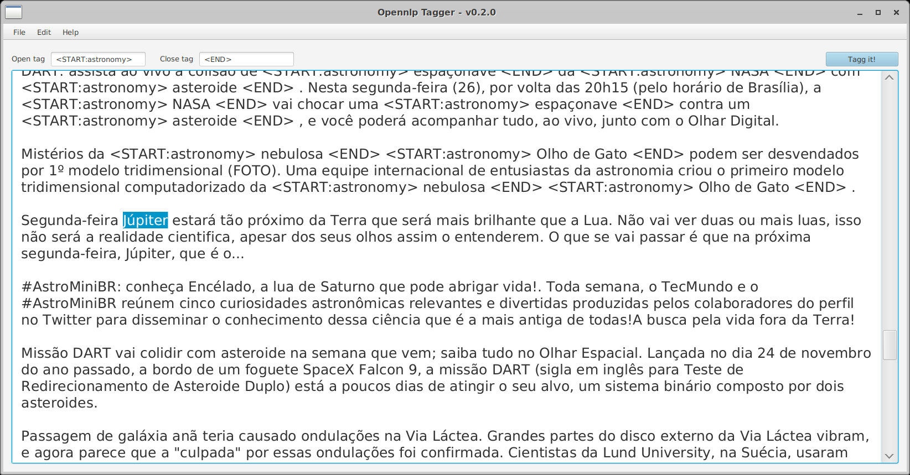

# opennlp-tagger


## _Desktop editor to tagging for Open NLP models_

[](https://travis-ci.org/joemccann/dillinger)

A simple desktop application to help manually tagging files to train models for Apache Open NLP _(or other Natural Language Processing (NLP) projects)_.


   

## Build and run

### Prerequisites
You must have Java SE installed in your environment and set JAVA_HOME.

### Clone repository

Clone this repository: `git clone https://github.com/diegoqueres/opennlp-tagger`. 

After that, follow these steps:

### 1) Enter on project path _(by your OS terminal)_
```bash
cd <<opennlp-tagger path>>
```

### 2) Build project

**Windows**:
```bash
./mvnw.cmd clean install
```
**Unix system**:
```bash
./mvnw clean install
```

### 3) Run application

**Windows**:
```bash
./mvnw.cmd javafx:run
```
**Unix system**:
```bash
./mvnw javafx:run
```


## License

MIT

**Free Software, Hell Yeah!**

  [Maven Wrapper]: <https://www.baeldung.com/maven-wrapper>